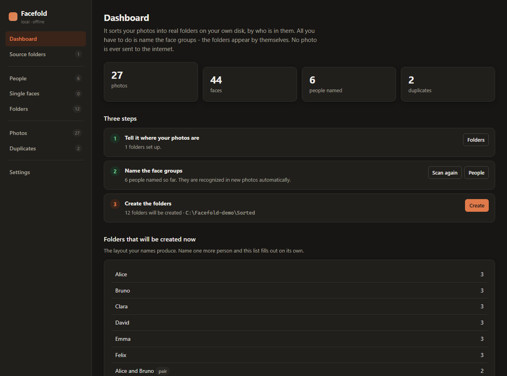
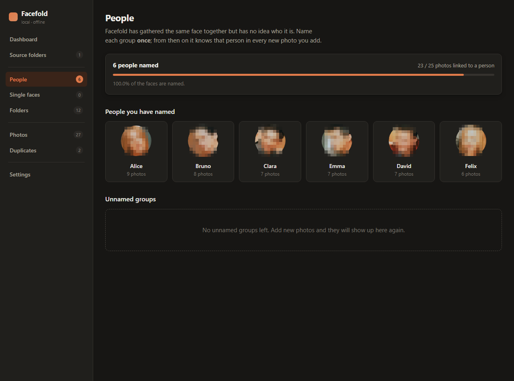
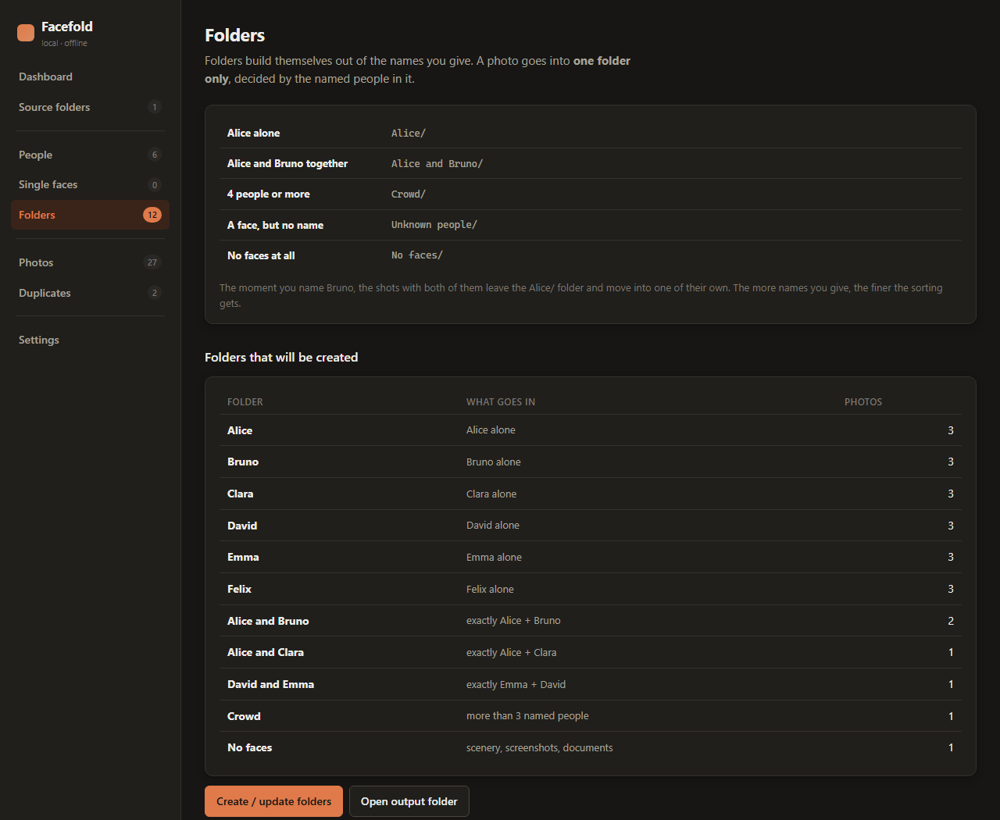

# Facefold

**Telefondan ve buluttan dökülen karışık fotoğraf yığınını, içindeki kişilere göre diskinizde gerçek klasörlere ayırır. Hiçbir fotoğraf internete gönderilmez.**

[](LICENSE)
[](https://www.python.org/downloads/)
[](#gizlilik)
[](facefold/i18n.py)

*Read this in English: [README.md](README.md)*



> **Hızlı başlangıç:** [`kur.bat`](kur.bat) → [`baslat.bat`](baslat.bat) → tarayıcıda `127.0.0.1:8760`.
> Dört adım: klasörü gösterin, taratın, yüz gruplarına isim verin, klasörleri oluşturun.

---

## Sorun

Telefonun hafızası doluyor. Kabloyu takıp bilgisayara aktarıyorsunuz. Google Fotoğraflar'dan da indiriyorsunuz. Sonuç: `IMG_4471.HEIC` diye başlayan, on binlerce dosyalık, içinde ne olduğu belli olmayan bir yığın.

Google Fotoğraflar yüzleri gruplayabiliyor — ama bu **onların sunucusunda** oluyor. İndirdiğiniz an her şey yine karman çorman. Diskinizde "Annem", "Eşimle ikimiz", "Çocuklar" diye klasörler yok.

## Facefold ne yapar

1. Gösterdiğiniz klasörleri tarar — **zip arşivlerinin içi dahil** — ve her fotoğraftaki yüzleri bulur.
2. Aynı kişinin yüzlerini kendiliğinden bir araya toplar.
3. Siz her gruba **bir kere** isim verirsiniz.
4. Hepsi bu. Klasörler isimlerden doğar.

Kural yazmanız, kategori kurmanız gerekmez. **Bir fotoğraf, içindeki isimlendirilmiş kişilere göre tek bir klasöre girer:**

```
Düzenlenmiş/
├── Alice/                  ← Alice yalnız
├── Alice ve Bruno/          ← tam olarak ikisi
├── Alice, Bruno ve Clara/   ← tam olarak üçü
├── Kalabalık/              ← 4+ tanınan kişi
├── Tanınmayan kişiler/     ← yüz var, isim yok
└── Yüzsüz kareler/         ← manzara, ekran görüntüsü, belge
```

Düzen isimlendirdikçe kendiliğinden zenginleşir: **Bruno'ya isim verdiğiniz an**, içinde ikisi de olan kareler `Alice/` klasöründen çıkıp kendi klasörüne taşınır. İsmi geri alırsanız geri dönerler. Yeni fotoğraf eklediğinizde tanıdığı kişileri kendisi bulur.

## Öne çıkan yanları

**Kombinasyon klasörleri kendiliğinden oluşur.** "Alice ve Bruno" klasörü *tam olarak* bu ikisi demektir — 15 kişilik düğün fotoğrafı oraya girmez, `Kalabalık/` klasörüne gider. Google Fotoğraflar'da iki kişiyi filtreleyebilirsiniz ama bu kalıcı, dışa aktarılabilir bir klasöre dönüşmez.

**Zip'leri açmanıza gerek yok.** Google Takeout onlarca zip halinde gelir ve toplamı yüz gigabaytı bulabilir. Facefold arşivi hiç açmaz: fotoğrafı analiz için zip'in içinden okur, yalnızca klasöre yerleşirken o tek dosyayı çıkarır. Elli arşivlik bir dışa aktarımın taranması **iki saniyenin altında** sürer.

**Google'ın verdiği isimleri içeri alır.** Takeout'taki metadata dosyalarında Google Fotoğraflar'da daha önce isimlendirdiğiniz kişiler ve fotoğrafların **gerçek çekim tarihi** durur — Takeout dışa aktarırken çoğu dosyanın EXIF'ini siler.

**İstemediklerinizi silebilirsiniz.** Toplu silme var: bir kişinin bütün fotoğrafları, bütün kopyalar, yüzsüz kareler ya da elle seçtikleriniz. Hepsi **Geri Dönüşüm Kutusu'na** gider — kalıcı silme yolu yoktur.

**Disk şişmez.** Varsayılan olarak sabit bağlantı (hardlink) kullanılır: fotoğraf diskte bir kez durur, on ayrı klasörde normal dosya gibi görünür. 4000 fotoğrafı 10 kategoriye dağıtmak sıfır ek yer kaplar.

**Kaynak dosyalarınıza dokunulmaz.** Hiçbir dosya taşınmaz, silinmez, yeniden adlandırılmaz. Program sadece çıktı klasöründe kendi oluşturduğu dosyaları silebilir.

**Kopyaları ayıklar.** Aynı fotoğrafı hem telefondan (HEIC) hem Google'dan (yeniden sıkıştırılmış JPEG) aldıysanız, format ve boyut farklı olmasına rağmen ikisini tek fotoğraf olarak tanır ve klasöre bir kez koyar. Aslı olarak telefondan gelen orijinali seçer. ([test](tests/test_heic.py))

**İnternet yok.** Model bir kez indikten sonra program hiçbir bağlantı kurmaz. Aile fotoğrafları, çocuk yüzleri bilgisayarınızdan çıkmaz.

**Türkçe ve İngilizce.** Arayüz dili Ayarlar'dan değişir; klasör adları da onu izler — İngilizce'de "Alice ve Bruno" klasörü "Alice and Bruno" olur ve dosyalar taşınır, ikinci kopya oluşmaz.

## Gizlilik

Bu programın var olma sebebi gizlilik. Aile fotoğrafları, çocuk yüzleri ve yüz tanıma verisi, bir şirketin sunucusuna değil, kendi diskinize aittir. Söz verilen şey ölçülebilir olsun diye burada açıkça yazıyor:

**Hiçbir fotoğrafınız hiçbir yere gönderilmez.** Program tek bir kere, ilk çalıştırmada, yüz tanıma modelini indirir (~280 MB). O andan sonra ağ bağlantısı kurmaz. İnternet kablosunu çekip kullanabilirsiniz. Arayüz yalnızca `127.0.0.1` adresini dinler — aynı ağdaki başka bir bilgisayar bile açamaz.

**Analiz sonuçları da yereldir.** Yüzlerden çıkarılan kimlik vektörleri, küçük resimler ve yüz kırpıntıları bilgisayarınızda `veri/` klasöründe durur:

| Yer | İçinde ne var |
|---|---|
| `veri/facefold.db` | Dosya yolları, tarihler, isimler, yüz vektörleri |
| `veri/kucuk/` | Fotoğrafların küçük önizlemeleri |
| `veri/yuzler/` | Yüz kırpıntıları (kişi kartlarındaki resimler) |

**Her şeyi silmek tek klasörü silmektir.** `veri/` klasörünü silin; program sıfırdan başlar. Fotoğraflarınıza dokunulmaz, çünkü program kaynak dosyalarınızı hiç değiştirmez.

**Fotoğraflarınız bu depoya karışamaz.** `veri/`, `Duzenlenmis/`, bütün `.db` dosyaları ve test fotoğrafları `.gitignore` ile dışarıda tutulur. Projeyi `git clone` ile indiren biri sizin hiçbir verinizi görmez; kaynak koddan başka bir şey yoktur.

### Katkı verecekler için

Bu projeye katkı verirken **kendi fotoğraflarınızı ve verinizi yayınlamamaya** dikkat edin. `git add -A` demeden önce:

- `git status --ignored` ile `veri/` klasörünün gerçekten dışarıda olduğunu görün.
- Ekran görüntüsü ekliyorsanız **gerçek fotoğraflarla değil**, `python tests/make_fixtures.py` ile üretilen örnek kütüphaneyle alın. Bu kütüphanedeki yüzler zaten bulanıklaştırılmıştır.
- Ekran görüntüsünde **Windows kullanıcı adınız** (`C:\Users\...`) görünmesin — programı `C:\Facefold-demo` gibi nötr bir klasörden çalıştırın.
- Kod yorumlarına ve testlere örnek isim yazarken gerçek kişi adı kullanmayın. Projede bunun için uydurma bir örnek kişi var: `Ayşe Şahin`.
- Bir şey yanlışlıkla commit'lendiyse, dosyayı silmek yetmez — git geçmişinde kalır ve herkes görebilir. Böyle bir durumda issue açın, geçmiş birlikte temizlensin.

## Kurulum

Python 3.10 veya üstü gerekir. ([python.org/downloads](https://www.python.org/downloads/) — kurulumda **"Add Python to PATH"** kutusunu işaretleyin.)

**Windows'ta:** `kur.bat` dosyasına çift tıklayın, bitince `baslat.bat` dosyasına çift tıklayın.

**Elle:**

```bash
python -m pip install -r requirements.txt
python calistir.py
```

Tarayıcıda `http://127.0.0.1:8760` açılır. İlk analizde yüz tanıma modeli otomatik iner (~280 MB, bir kereye mahsus).

## Kullanım

| Adım | Ne yaparsınız |
|---|---|
| 1 | **Kaynak klasörler** → fotoğraflarınızın olduğu klasörün yolunu yapıştırın |
| 2 | **Taramayı başlat** → tarama, yüz analizi, kopya ayıklama, gruplama sırayla çalışır |
| 3 | **Kişiler** → her yüz grubuna isim verin (bir kere) |
| 4 | **Klasörleri oluştur** → çıktı klasörü dolar |

Yanlış giren yüzü kişi sayfasından çıkarabilir, iki kişiyi birleştirebilir, hiçbir gruba giremeyen tek kareleri **Tek kareler** ekranından tek tek atayabilirsiniz.



> Ekran görüntülerindeki yüzler kasten bulanıklaştırılmıştır — test verisi gerçek kişilerin bulunduğu bir örnek fotoğraftan üretiliyor.

### Kural türleri

Otomatik düzen çoğu kişiye yeter. İsterseniz **Klasörler → Gelişmiş** altından kendi kurallarınızı da yazabilirsiniz:

| Kural | Anlamı |
|---|---|
| **Yalnızca bu kişi** | Karede başka tanınan kimse yok. |
| **Tam olarak bu kişiler** | Seçtikleriniz var ve başka tanınan kimse yok. |
| **Hepsi var** | Seçtikleriniz var, yanlarında başkaları da olabilir. |
| **En az biri var** | "Çocuklardan herhangi biri" gibi geniş toplamalar. |
| **Kalabalık** | Belirlediğinizden fazla tanınan kişi. |
| **Hiç yüz yok** | Manzaralar, ekran görüntüleri, belge fotoğrafları. |
| **Yüz var ama tanınmayan** | İsimlendirmediğiniz kişilerin olduğu kareler. |

Her kurala ayrıca tarih aralığı, en küçük yüz boyutu ve "arka plandaki yabancılar kuralı bozmasın" seçeneği eklenebilir. Elle yazdığınız kurallar otomatik olanlardan önce gelir ve silinmez.



## Nasıl çalışıyor

| Katman | Yöntem |
|---|---|
| Klasörleme | İsimlendirilmiş kişi kümesine göre bölümleme (`auto.py`) |
| Yüz tespiti | SCRFD (`det_10g`) |
| Kimlik vektörü | ArcFace `w600k_r50`, 512 boyut |
| Yaş / cinsiyet | insightface `genderage` — çocukların yıllar içinde değişen yüzlerinde ipucu |
| Gruplama | Sıkı eşikli ön birleştirme + ortalama bağlantılı hiyerarşik kümeleme |
| Kopya tespiti | SHA-1 + algısal parmak izi (DCT) + en/boy oranı + piksel imzası |
| Depolama | SQLite; çıktı klasörleri her an sıfırdan yeniden kurulabilir |
| Arşiv | Zip içinden okuma, yerleşirken tek üye çıkarma |
| Silme | Yalnızca Geri Dönüşüm Kutusu (`send2trash`) |
| Arayüz | Flask, yalnızca `127.0.0.1` |

Kopya kararının **üç kontrolün üçünü birden** geçmesi gerekir. Algısal parmak izi tek başına düz gökyüzü, beyaz duvar gibi detaysız kareleri birbirine karıştırır; en/boy oranı ve piksel imzası bunu engeller.

Gruplama iki aşamalıdır: önce çok benzer kareler (patlamalı çekimler, aynı an) sıkı bir eşikle birleştirilir, sonra asıl kümeleme bu çok daha küçük küme üzerinde çalışır. 50.000 yüze doğrudan hiyerarşik kümeleme uygulamak 20 GB'lık bir mesafe matrisi ister; bu yöntem aynı sonucu çok daha ucuza verir.

## Hız

Ölçüm: 12 megapiksel HEIC dosyaları (4032×3024, iPhone boyutu), gerçekçi bir karışım (12 tek kişilik portre + 4 ikili + 2 kalabalık + 2 yüzsüz), masaüstü CPU, GPU yok, 4 iş parçacığı.

**Fotoğraf başına 1,12 saniye.**

| Fotoğraf | Yaklaşık süre |
|---|---|
| 1.000 | ~20 dakika |
| 5.000 | ~1,5 saat |
| 20.000 | ~6 saat |

Karedeki yüz sayısı doğrudan etkiler: yüzsüz bir manzara 0,4 saniye, altı kişilik kalabalık bir kare 2,6 saniye sürer. Küçük fotoğraflarda (1–2 MP) hız yaklaşık beş katına çıkar.

Sadece ilk seferde. Sonraki taramalarda yalnızca yeni dosyalar işlenir. İşlem yarıda kesilirse kaldığı yerden devam eder.

> insightface varsayılan olarak her yüz için dört model çalıştırır. Bunlardan iki yüz-noktası modeli Facefold'ta kullanılmıyor ve kapatıldı — tek başına **%44** hız kazancı (bkz. `config.ACTIVE_MODULES`).

## Geliştirme

```bash
python tests/make_fixtures.py    # bilinen cevaplı örnek kütüphane üretir
python tests/test_pipeline.py    # boru hattının tamamı
python tests/test_web.py         # arayüz üzerinden uçtan uca
python tests/test_heic.py        # iPhone HEIC + formatlar arası kopya
python tests/test_auto.py        # otomatik klasörleme, zip, Türkçe isim, silme
python tests/test_dil.py         # dil değişimi ve klasörlerin taşınması
python tests/test_denetim.py     # geçmişte çıkmış hataların geri gelmemesi
```

Test kütüphanesi, insightface ile gelen örnek grup fotoğrafındaki altı yüzden portreler, ikili kareler ve kopyalar üretir. Doğru cevap önceden bilindiği için kural motoru gözle değil, iddiayla denetlenir.

```
facefold/
├── config.py       ayarlar, eşikler
├── db.py           SQLite şeması
├── imaging.py      HEIC, EXIF, parmak izi, küçük resim
├── archives.py     zip içindeki fotoğraflar
├── scanner.py      klasör tarama, kopya ayıklama
├── faces.py        yüz tespiti + kimlik vektörü
├── pipeline.py     çözümleme hattı (çok iş parçacıklı)
├── clustering.py   gruplama, isimlendirme, birleştirme
├── names.py        Türkçe isim karşılaştırma, klasör adı
├── i18n.py         arayüz dili — yeni dil eklemek burada bir sütun
├── auto.py         otomatik klasörleme — kişi = klasör
├── rules.py        kural motoru
├── takeout.py      Google Fotoğraflar metadata'sı
├── trash.py        toplu silme (Geri Dönüşüm Kutusu)
├── distribute.py   klasör oluşturma (hardlink / kopya / rapor)
└── web/            Flask arayüzü
```

## Katkı

Katkıya açıktır. Öncelikli konular:

- **Video desteği** — kareden yüz çıkarma, iPhone Live Photo dosyalarını ayırt etme (`archives.py` videoları zaten sayıyor, altyapı hazır)
- **GPU desteği** — `onnxruntime-gpu` ile 10–20 kat hız
- **Yeni diller** — arayüz Türkçe ve İngilizce. Yeni bir dil, [`facefold/i18n.py`](facefold/i18n.py) içine bir sütun eklemektir; yarım kalan çeviri İngilizce'ye düşer, bu yüzden tamamlanmamış katkı da kabul edilir
- **macOS / Linux denemesi** — kod taşınabilir yazıldı ama yalnızca Windows'ta test edildi
- **Klasör seçme penceresi** — şu an yol elle yapıştırılıyor

Kod ve yorumlar İngilizce yazılır; kullanıcıya görünen metin şablona değil `i18n.py` sözlüğüne girer. Bir değişiklik gönderirken `tests/test_pipeline.py`, `tests/test_web.py` ve `tests/test_dil.py` geçmelidir. Katkı verirken uyulması gereken gizlilik kuralları için [CONTRIBUTING.md](CONTRIBUTING.md) dosyasına bakın.

## Lisans

MIT — bkz. [LICENSE](LICENSE).

Yüz tanıma modelleri [insightface](https://github.com/deepinsight/insightface) projesine aittir; kendi lisans koşulları geçerlidir.
